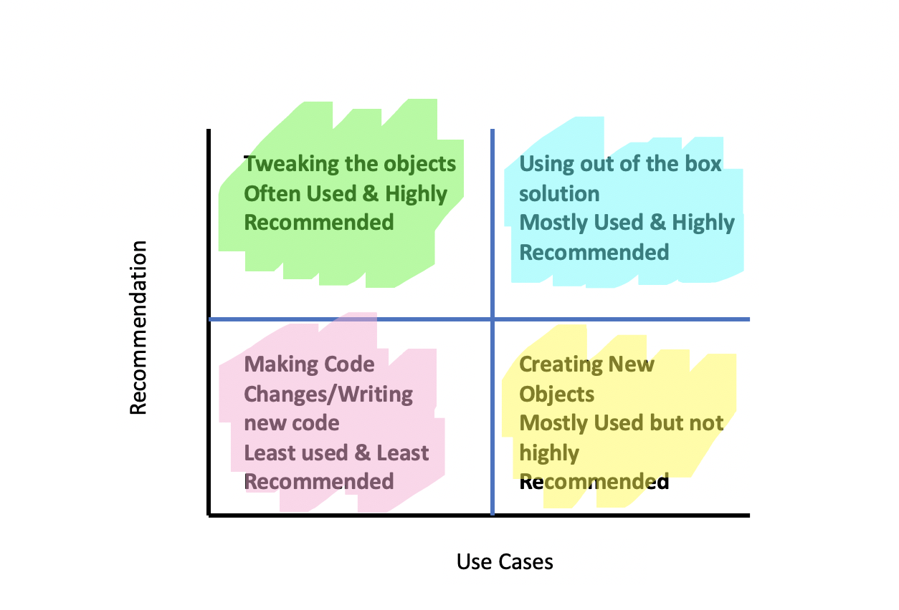

# Customizations

 It is recommended to use the following approach while adopting a CRM solution:

 1. Use out-of-the-box functionality: In most cases, you will be able to find what you need by using the functionality that is available by default in the CRM solution you bought.

 2. Make configurations: More often than not, as you business grows, so does your CRM. You may want to tweak properties of objects, such as increasing the size of your fields. This can be achieved largely by making configuration changes to objects.

 3. Creating New Objects: Configuration changes do not permit you to add objects such as new fields, new menu options or new screens. In these circumstances you will need to create new objects, but this can be done without writing code and by using in built designer tools. 

 4. Developing new scripts: In most of the cases, customizations will not require you to write code. However more complex scenarios such as integrations with 3rd party application will require you to write code to make changes to the way the CRM solution works. This is least recommendeded scenario.

  

## Customizing Microsoft Dynamics 365

### User Stories

#### Next Gen Network App

- Application from Ministry of Education 
- Hosted on Dynamics 365 on Azure managed by OCIO
- Not many custom objects were added to the App
- Most of the enhancements done were around adding extra security fields, adding security profiles to prevent fields being visible to external vendors as well as hiding implementations details
- A non managed CRM solution being used in most cases in BC Gov. Managed CRM solutions are handy when you are a consulting firm and want to package a CRM solution and sell it to a customer ensuring that they can not make any changes to the source. The major drawback of a managed solution is that, if there is a need to rollback, it results in deleting the data.
- There are four environments on which the App is hosted in Dynamics on Azure (Dev, Test, UAT and Prod).
- 95% of the changes were made without making code changes.
- Whenever there is a need to make a change, a blank solution is created, the solution is developed on the Dev environment and the changes are added to the blank solution. The blank solution is downloaded in form of xml files and uploaded to a source control, in this case, SVN. This solution is then released and migrated to UAT and Prod environments using the Dynamics Solution Migration where typically a container is created and changes are deployed to Production.
- Changes can also be made using the Environment Copy approach. But this is not recommended and is only performed when a new App is being deployed to Dynamics, where a copy of the Dev environment is made to production, this could lead to overwriting data in Production, due to which this method is not preferred.
- Dynamics on Cloud is frequently updated and it has been found that the on prem Dynamics is mostly a couple of versions behind the Dynamics on cloud. The application architects, dynamics developers and administrators need to constantly keep themselves up-tp-date with new version upgrades.
- Any new objects created or updated are logged using the object description and other documentation methods. Dynamics offered a space known as Knowledge base articles but it has not been found extremely useful. Adding new objects is relatively simple procedure and you can use the screen to intuitively add names of fields you want create or add.
- Any code changes made have been made by external vendors or contractors and Ministry as well as Microsoft recommends least amount of changes using code. It is encouraged to make configuration changes as much as possible.
- Customizations using Code are mostly required when there need to be third party integrations like integrating with CAS (a Ministry of Finance application). 3rd party integrations are extremely complex with Microsoft Dynamics and it works well as a standalone app. Microsoft Dynamics supports languages such as C, C#, HTML, CSS and JavaScript for making code changes or writing new functionality.

