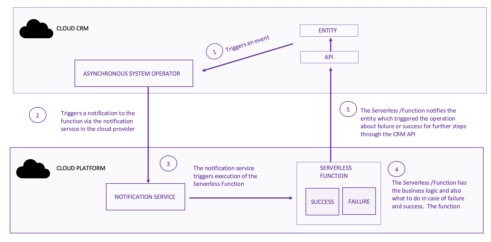

# Other CRM Platforms

## Opensource CRM
 
 Propreitary CRM solutions are finalized products which mostly require a subscription. If you rather customize and modify the CRM solution to suit your needs, it is best to choose an free and open souce CRM solution.

 Several OpenSource solutions are available in the market too. Though there are a few opensource CRM solutions that are available as SaaS, most of these solutions are available to be consumed in the form of source code and would require a team of developers to implement the solution on on-prem or cloud infrastructure and maintain the same.

 Some of the opensource CRM solutions are given below:

### HubSpot CRM

HubSpot CRM was started in 2004 and provides tools that can be used by small to large enterprises. HubSpot CRM provides free marketing, sales, customer service, and contact management tools.

##### Features

    ✓ Contact management                 ✓ Ad management
    ✓ Contact website activity           ✓ Conversations inbox
    ✓ Companies                          ✓ Reporting dashboard
    ✓ Deals                              ✓ Email tracking & notifications
    ✓ Tasks & activities                 ✓ Email templates
    ✓ Company insights                   ✓ Canned snippets
    ✓ Gmail and Outlook integration      ✓ Canned snippets
    ✓ App Marketplace integrations       ✓ Documents
    ✓ Custom support form fields         ✓ Calling
    ✓ Prospects                          ✓ Meeting scheduling
    ✓ Ticketing                          ✓ Messenger integration
    ✓ Forms                              ✓ Custom properties

##### Pros

    ✓ Unlimited number of users                        
    ✓ Free and OpenSource                            

##### Cons

    ✕ Limited syncing between contact and deal data    ✕ Weak search function
    ✕ Inability to log email attachments to contact    ✕ Large range of features, but lack depth
      records

### SuiteCRM

SuiteCRM is a free and open source CRM application written in PHP. SuiteCRM can be downloaded for free and installed on any physical server or on cloud. SuiteCRM also offers a hosted CRM option called Suite:OnDemand which however comes with a price.

##### Features

    ✓ Accounts management          ✓ Events management            ✓ Quotes module
    ✓ Bug tacking                  ✓ Invoices module              ✓ Reports module   
    ✓ Calendar management          ✓ Knowledge Base module        ✓ Targets module   
    ✓ Calls module                 ✓ Leads module                 ✓ Target Lists module
    ✓ Campaigns module             ✓ Meetings module              ✓ Tasks module
    ✓ Cases module                 ✓ Notes module                 ✓ Workflow module
    ✓ Contacts module              ✓ Opportunities module         ✓ Responsive layout feature
    ✓ Contracts management         ✓ PDF Templates module         ✓ Languages feature
    ✓ Documents repository         ✓ Products catalogue           ✓ Customizable frontpage feature
    ✓ Emails module                ✓ Projects module              ✓ Role Management feature 
    ✓ Customizable menu feature    ✓ User Management feature      ✓ Advanced Search feature       
    ✓ Developer Tools feature      ✓ Password Management feature  ✓ Desktop Notifications feature 
    ✓ Rest API feature             ✓ System settings feature      
    ✓ Security Suite Group Management feature
    
##### Pros

    ✓ Unlimited number of users        ✓ Endless modular customizability
    ✓ Real Time dashboard              ✓ Cross Platform
    ✓ User Friendly                    ✓ Supports sales, service, and marketing modules                  

##### Cons

    ✕ Helpdesk support can be slow     ✕ Moderate learning curve
    ✕ SuiteCRM doesn’t integrate with ERP

## Serverless Options

 Deploying a CRM solution on Cloud as opposed to hosting one on prem has the following benefits:

  1. There would be no underlying hardware or infrastructure or maintain
  2. Ensure high availability and resilience
  3. There would be tighter integrations with other cloud products
  4. It would be easier and faster to implement a CRM solution on cloud
  5. The CRM applications would be highly scalable on cloud

  In order to further reduce costs, you can make use of Functions as a Service (FaaS) to execute tasks which happen less frequently in order to save cloud resources. 
  
  For example, Approvals and Consents on Applications might not happen very frequently. It would be best to trigger these operations as serverless functions when these events are triggered. 

  