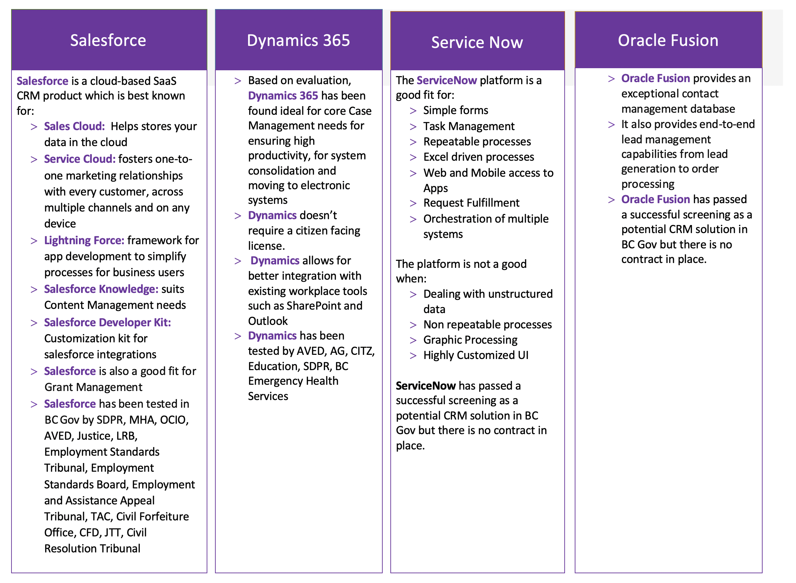

# Qualified CRM Platforms

## Popular CRM Options
 
1. **Salesforce** *1* : Salesforce is an online cloud-based customer relationship management system which integrates your customers and breaks the silos between marketing, sales, commerce and IT services.

2. **Microsoft Dynamics 365** *2* : Dynamics 365 is a product line of enterprise resource planning and customer relationship management that helps you run your entire business and deliver greater results through predictive, AI-driven insights.

3. **ServiceNow** *3* : ServiceNow helps connect customer service with other teams within an organization to resolve issues quickly and proactively.

4. **Oracle Fusion** *4* : Oracle Fusion is a cloud-based PaaS solution which enables enterprises to create and run agile, intelligent business applications while maximizing IT efficiency through full utilization of modern hardware and software architectures.

When a CRM solution has to be implemented, it is important to explore the various options available in the market before you decide to build a custom solution. Some of the popular CRM solutions include Salesforce, Microsoft Dynamics, ServiceNow, Oracle Fusion etc.

Out-of-the-box Microsoft Dynamics could be classified as a CRM system, as could SalesForce.  However, given the risk and associated cost, of building dependencies upon a platform such as (SalesForce) force.com or upon Dynamics (the PaaS), for this exercise, we must differentiate between them.  

## CRM Adoption

 

The table given below highlights the key differences between the top 4 CRM platforms chosen by BC Government, based on the analysis performed by various ministries:

## Preferred Direction
 

The preferred direction to distinguish between various CRM options is :

- Distinguish CRM from the platforms upon which they’re built
- Determine guidelines for the use of both, and provide advisory services for implementation of both.  
- Guard against the accidental overlap – build upon a CRM platform must be an explicit and fully-informed decision, to guard against vendor product and service lock-in, and to optimize exit costs. 

## CRM Procurement in BC Gov
 

In 2018 the Province of BC submitted a Request of Qualification (RFQ 060518 CUSTOMER RELATIONSHIP MANAGEMENT (“CRM”) PLATFORM) to build a pre-qualified list of vendors for cloud CRM platform vendors that are able to seamlessly manage the diverse set of government-to-citizen, or government-to-organization, interactions that comprise the “citizen lifecycle” leveraging multi-channel delivery to support integrated service delivery, both internal and external to government.

Applicants are screened by the Province on technical, security, and privacy requirements outlined in RFQ Questionnaire. The RFQ does not include implementation or other related professional services or subscription resellers.

The RFQ is open for 5 years leading to four successful applicants:

#### **Salesforce**:

• Contract in place for core government 
• PIA and STRA for PII

#### **Microsoft Dynamics 365**:

• Contract in place for core government 
• PIA and STRA for Non-PII

#### **ServiceNow**:

• Successful Screening 
• No Contract, PIA, or STRA

#### **Oracle Fusion**:

• Successful Screening 
• No Contract, PIA, or STRA

(CRM Procurement Guidelines)[CRM-ProcurementCriteria]

## References:

\[*1*\]: [*What is Salesforce?*](https://www.salesforce.com/ca/products/what-is-salesforce/) 

\[*2*\]: [*What is Microsoft Dynamics 365?*](https://dynamics.microsoft.com/en-us/what-is-dynamics365/)

\[*3*\]: [*What is ServiceNow?*](https://www.servicenow.com/products/customer-service-management.html)

\[*4*\]: [*What is Oracle Fusion?*](https://www.oracle.com/middleware/#:~:text=Cloud%20Platform%20for%20Digital%20Business,modern%20hardware%20and%20software%20architectures.)

