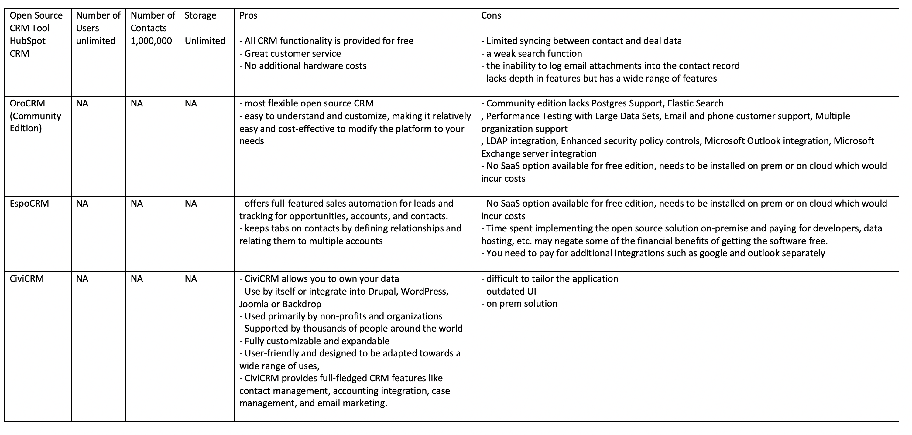

# Customer Relationship Management

**Archetype: Customer Relationship Management** 

## What is it?  
Customer relationship management (CRM) is the management of an organization's interaction with current and potential customers. Customers in a public sector context include citizens, businesses, and other stakeholders. Some defining features of a CRM include a centralized contact list and correspondence tracking. A CRM may include workflow capabilities, analytical features to measure customer satisfaction, lead potential, and integrations with call centre applications, and other communication systems such as email. 
 
## What it is not

We must distinguish between the need for a CRM solution, and building other systems upon a platform that is (or was) at its core, a CRM system, simply because they are related systems.  Although "case management" might be (arguably) seen by some as a derivative of CRM, for this exercise, one is not the other.  A "CRM platform" is not necessarily CRM, though it does enable CRM capabilities. 

## Examples

 Out-of-the-box Microsoft Dynamics could be classified as a CRM system, as could SalesForce.  However, given the risk and associated cost, of building dependencies upon a platform such as (SalesForce) force.com or upon Dynamics (the PaaS), for this exercise, we must differentiate between them.  

Preferred Direction: Distinguish CRM from the platforms upon which they’re built.  Determine guidelines for the use of both, and provide advisory services for implementation of both.  Guard against the accidental overlap – build upon a CRM platform must be an explicit and fully-informed decision, to guard against vendor product and service lock-in, and to optimize exit costs. 

For discussion: Should "lower-level" capabilities like the ones mentioned above (mail, analytics, workflow) be in this list, or a separate list, or neither?

## CRM Procurement 

In 2018 the Province of BC submitted a Request of Qualification (RFQ) to build a pre-qualified list of vendors for cloud CRM platform vendors that are able to seamlessly manage the diverse set of government-to-citizen, or government-to-organization, interactions that comprise the “citizen lifecycle” leveraging multi-channel delivery to support integrated service delivery, both internal and external to government.

Applicants are screened by the Province on technical, security, and privacy requirements outlined in RFQ Questionnaire. The RFQ does not include implementation or other related professional services or subscription resellers.

The RFQ is open for 5 years leading to four successful applicants:

### Salesforce:

• Contract in place for core government 

• PIA and STRA for PII

### Microsoft Dynamics 365

• Contract in place for core government 

• PIA and STRA for Non-PII

### ServiceNow

• Successful Screening 
• No Contract, PIA, or STRA

### Oracle Fusion

• Successful Screening 
• No Contract, PIA, or STRA

## CRM Adoption

### Salesforce

• Process tested: SDPR, MHA, OCIO, AVED, Justice, LRB, Employment Standards Tribunal, Employment Standards Board, Employment and Assistance Appeal Tribunal, TAC, Civil Forfeiture Office, CFD, JTT, Civil Resolution Tribunal

### Microsoft Dynamics 365

• Process tested: AVED, AG, CITZ, Education, SDPR, BC Emergency Health Services

### ServiceNow

• Awaiting first initiative

### Oracle Fusion

• Awaiting first initiative

## Open Source CRM tools

   

   
## Test case:

COTs vs Custom vs Open Source

