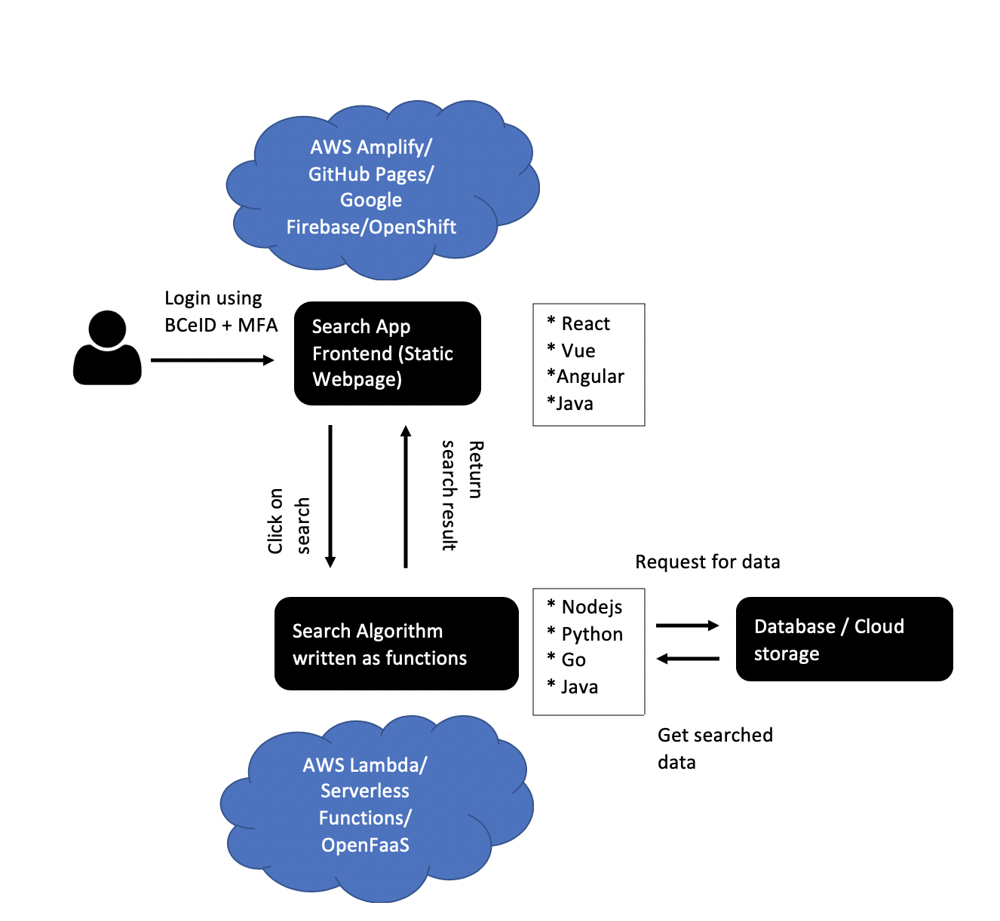

# Serverless Compute

   With the evolution of PaaS and focus on agile software development, it became key to empower developers to be able to make frequent changes, test their changes in a production like environment and enable them to write code without focusing on the infrastructure concerns. Platform such as the RedHat OpenShift made it easier to offload infrastructure provisioning and maintenance from the development teams. They just needed to worry about the resources in their projects and not monitoring and managing the backend infrastructure. 

   Serverless makes it more simpler than PaaS. With Serverless compute, it doesn't mean you have no servers, it just means, you dont need to provision, configure or manage them any longer. This would be taken care of by the cloud provider. 

   The cloud giants are adding multiple serverless capabilities using which one can simply connect their github repositories to the service and AWS takes care of deciding which docker image needs to be used and the deployment. Webhooks can be set up and deployments can be triggered off branches when the developer commit their code. 
 
   There is also the evolution of FaaS or functions as a service which ensure your resources are not running when they are not required and you only pay for them when used. Using functions as a service, you can trigger an event from a static webpages or cloud storage or even from code repositories which run the functions, that can be written in Python, Go, Java, Ruby or Nodejs which perform some action and write the outcome to a database or cloud storage and return a token to the end user using which they can track the status of their action on the frontend. This is one of the few examples of various capabilities of functions. AWS (AWS Lambda), GCP (Serverless Functions) and Azure(Azure Functions) provide different FaaS services and so does Openshift (OpenFaaS).

   [AWS vs GCP vs Azure FaaS](assets/Serverless_comparison.xlsx)
   
   [Containers vs Serverless](assets/ContainersVsServerless.xlsx)

## Pros

1. The biggest advantage of using serverless compute is paying only for the infrastructure resources you use and when you use them.

2. The maintenance, updates and patches of underlying infrastructure is the responsibility of the cloud provider.

3. It is easier to set up different environments and deploying across different environments is really quick. It also inherently makes your application scalable based on demand.

4. It empowers the developers to embed security within their application and code paving way towards the adoption of DevSecOps.

## Cons

1. It might be hard to move your current applications hosted over legacy systems to serverless architectures without rewriting the code or without a significant learning curve.

2. While using serverless architectures, you are typically getting rid of underlying system control and might encounter downtime planned by the service provider.

3. There is a possible vendor lock-in while trying to implement FaaS

## The BC Gov Story

BC Government has two datacenters, one located in Kamloops and the other in Calgary. The one is Calgary is mostly used to host Delivery and Test Environments and the one in Kamloops hosts the production environments.

### Application statistics

| Type of Software category | Application Archetype | Number of Apps that are Serverless |
| --------------------------|-----------------------|------------------------------------|
|                           | Call Centre           |                                    |
|                           | Case Management       |                                    |
|                           | Content Management    |                                    |
|                           | CRM                   |                                    |
|                           | Grant Management      |                                    |
|                           | HR                    |                                    |
|                           | Learning              |                                    |
|                           | Licensing             |                                    |
|   Business Applications   | Mapping               |                                    |
|                           | Online Disputes       |                                    |
|                           | Payment               |                                    |
|                           | Portfolio Management  |                                    |
|                           | Registry              |                                    |
|                           | Reporting             |                                    |
|                           | Service Management    |                                    |
|                           | Survey                |                                    |
| Productivity Applications | Office 365            |                                    |     
|                           | Skype                 |                                    |  
|                           | DBMS                  |                                    |
|                           | Middleware            |                                    |
|                           | Search                |                                    |
|    System Applications    | Notification          |                                    |
|                           | Integration           |                                    |
|                           | Accessibility         |                                    |
|                           | Access Management     |                                    |
|                           | Bulk Email            |                                    |

### Applications Archetypes that can be hosted on Serverless Compute Services

  **Archetype: BizApp-Search**

  

### Best Practices to move from Physical Servers to Serverless Compute

### Best Practices to move from Virtual Machines to Serverless Compute

### Best Practices to move from Containers to Serverless Compute

